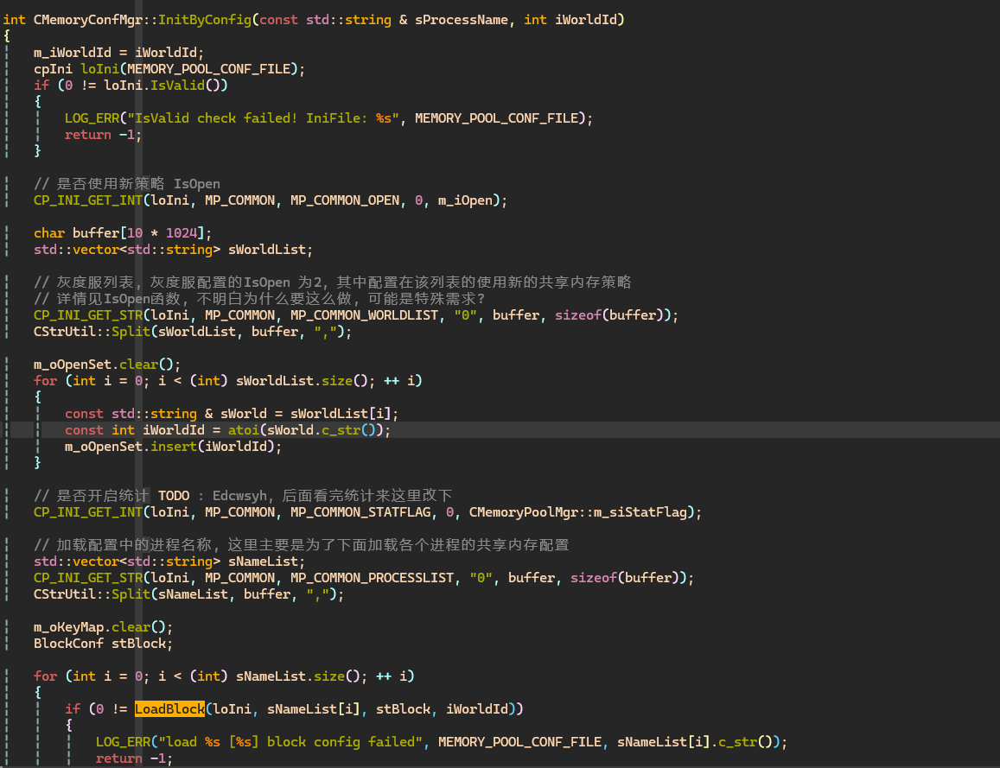
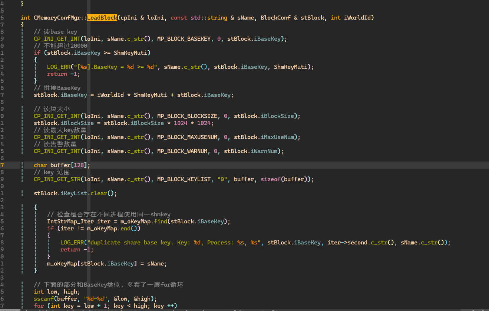

<h1 style="text-align:center;">共享内存篇</h1>
<h2 style="text-align:center;">目录</h2>

- <strong>(一) </strong>[共享内存配置器](#share-memory-config)
- <strong>(二) </strong>[共享共享内存池管理器](#share-memory-pool-manager)

<h2 id="share-memory-config" style="text-align:center;">共享内存配置器</h2>
相关文件 :   

-   <strong>run/binconf/zone/data/inidata/memorypool.ini</strong>  
-   <strong>run/binconf/zone/data/inidata/memorypool.ini.tmpl</strong>  
-   <strong>src/base/memorypool/MemoryConfMgr.h</strong>  
-   <strong>src/base/memorypool/MemoryConfMgr.cpp</strong>  

memorypool.ini是由memorypool.ini.tmpl生成的, 这部分没用什么好说的, 具体可以去看脚本代码. memorypool.ini文件最终会被CMemoryConfig加载  
CMemoryConfig是一个简单的配置读取工具, 直接看代码 :  

*TODO 把图片换成代码段*





这里比较核心的东西是加载各个进程的BaseKey, BlockSize等一系列东西, 主要分为以下几个步骤 :   
- 1.加载配置中的进程名称, 即`memorypool.ini`中的`ProcessList`变量
- 2.根据`ProcessList`中的进程名动态加载对应共享内存配置, 例如`[zone]`
- 3.计算每个`ShmKey`的所属进程, 如果出现多个进程同时引用同一`ShmKey`的情况, 则起服失败
- 4.保存自己进程的共享内存配置, 若开启共享内存分配新策略, 则初始化`CMemoryPoolMgr`

<h2 id="share-memory-pool-manager" style="text-align:center;">共享内存池管理器</h2>

这部分主要主要由两个类组测, [MemoryPoolMgr](#share-memory-class-memory-pool-manager), [ObjectMgr](#share-memory-class-object-manager)与[ShareMgr](#share-memory-class-share-manager)  
`MemoryPoolMgr`与`ObjectMgr`主要与用户打交道, 用户通过其提供的接口, 能够实现对共享内存的操作  
`ShareMgr`实现了对操作系统底层接口的封装, 如何判断热启动也是由它来实现的

<h3 id="share-memory-class-memory-pool-manager">MemoryPoolMgr类</h3>    

`MemoryPoolMgr`承担了共享内存的分配与管理工作, 它主要由以下这些成员对象和接口构成 : 

*TODO : 这里搞个超链接跳转*
-  `Init` : 负责共享内存池初始化部分
-  `ResumeBase` : 负责共享内存的重新拉起工作
-  `IsResume` : 是否是热启动
-  `AddType` : 添加一种可分配的对象类型
-  `Get*` : 通过ID获取共享内存对象指针
-  `GetFree*` : 尝试分配一个空闲的共享内存节点
-  `Free*` : 释放某一共享内存节点
-  `Process*` : 遍历所有节点, 并执行一些操作
-  `ForceGetObj` : `Get*`与`GetFree`的结合, 若节点不存在, 则尝试分配一个


<h4 id="share-memory-m-func-memorypoolmgr-init">接口 CMemoryPoolMgr::Init</h4>  

该接口主要的作用是在进程启动时判断是热启还是冷启  
在前文配置器当中我们提到一个变量`BaseKey`, 在进程启动时, `MemoryPoolMgr`会使用`BaseKey`调用`ShareMgr::CreateShm`创建共享内存, 这块共享内存主要用来存储 **共享内存的一些基本信息**, 它们包括主要包括 : 启动时间, 类型信息, 共享内存块信息;   
```cpp
// 相关代码 : 
// 文件 : src/base/memorypool/MemoryPoolMgr.cpp
int CMemoryPoolMgr::InitBase(uint32_t iBlockSize, const std::vector<int> & astBlockKeyList)
{
    // check something...

    // BlockSize 每块内存大小
    // StartTime 共享内存启动时间
    // MaxTypeInfoNum * TypeInfo 对象类型信息
    // MaxBlockNum * BlockBase 共享内存块信息
    // 存储共享内存基本信息大小
    const size_t iBaseSize = sizeof(uint32_t) + sizeof(uint64_t) + sizeof(TypeInfo) * MaxTypeInfoNum + sizeof(BlockBase) * MaxBlockNum;

    // get base info memory
    void * pBaseData = share.CreateShmem(m_iBaseKey, iBaseSize);
    // check pBaseData is null ...
    // ps : 都自己定义了IsResum(), 是不是调自己的更好一点? 虽然IsResume()实际上也是调用ShareMgr
    if (CShareMgr::Instance().IsResume())
    {
        // 热启动
        return ResumeBase(pBaseData, iBlockSize, astBlockKeyList, oKeySet);
    }

    // 初始化共享内存
    int offset = 0;
    * (uint32_t *) ((char *) pBaseData + offset) = iBlockSize; // 保存内存块大小
    // offset += ...
    * (uint64_t *) ((char *) pBaseData + offset) = m_tStartTime; // 保存内存启动时间

    // 初始化类型信息, 并将类型信息数组关联到共享内存
    TypeInfo * pTypeList = (TypeInfo *) ((char *) pBaseData + offset);
    for (int i = 0; i < MaxTypeInfoNum; ++ i)
    {
        TypeInfo * pTypeInfo = pTypeList + i;


        // bzero(pTypeInfo)
        pTypeInfo->iType       = i;
        // init pTypeInfo fill zero...
        m_oHashTypeInfo[i]     = pTypeInfo;
    }

    //...

    // 初始化共享内存块, 并将共享内存块数组关联到共享内存
    BlockBase * pBlockList = (BlockBase *) ((char *) pBaseData + offset);
    for (int i = 0; i < MaxBlockNum; ++ i)
    {
        BlockBase * pBlock = pBlockList + i;

        // bzero(pBlock)
        pBlock->iBlockIndex  = i;
        pBlock->iKey         = (i < iBlockKeySize)? astBlockKeyList[i]: -1;
        pBlock->iFreeSize    = iBlockSize;

        if (pBlock->iKey < 0)
        {
            continue;
        }

        m_oBlockFreeMap.insert(std::make_pair(pBlock->iBlockIndex, pBlock));
    }

    return 0;
}
```

在这个过程中`ShareMgr`便能够判断进程是冷启还是热启, 如果是热启, 则会直接调用`ResumeBase`重新拉起共享内存对象, 如果是冷启, 则会将要存储的信息写入该内存; 同时将类型信息数组`m_oHashTypeInfo`与空闲内存块`m_oBlockFreeMap`相关联并对二者进行初始化

<h3 id="share-memory-class-share-manager">ShareMgr类</h3>  

`ShareMgr`定义了两种状态, `EnmStartMode_Init`与`EnmStartMode_Resume`  
当程序一运行, `StartMode`会被初始化为`EnmStartMode_Init`, 

<h3 id="share-memory-class-object-manager">ObjectMgr类</h3>  